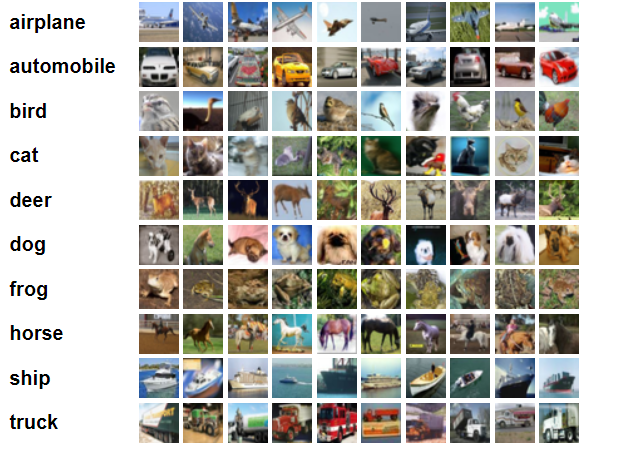
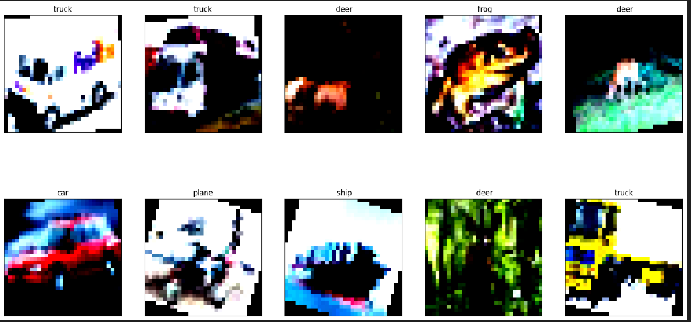
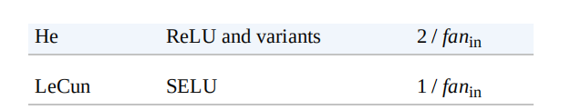
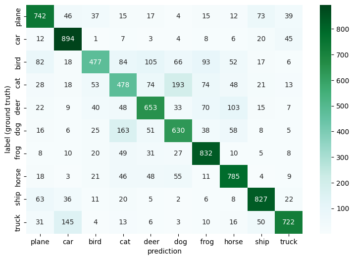
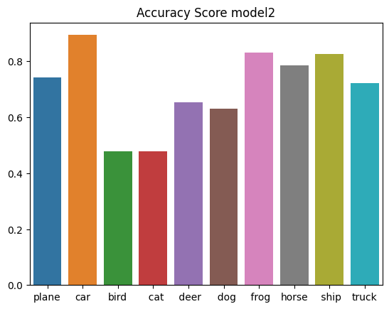

# Dataset
----
* The CIFAR-10 dataset consists of 60000 **32x32 colour images** in **10 classes**, with 6000 images per class. There are **50000 training** images and **10000 test** images.
* These are 10 classes of the data


* We put data into 500 batches each patch has 100 samples after making transformation on data

# Data preprocessing

* We did several transformations on data such as **Rsizing** to (32,32) , Random Horizontal Flip with probability .5 this is making data augmentation to increase data size and previnting from overfitting

* After that I made a Rotation with 20 degree
* Finally , I made a normalization with mean values
[0.485, 0.456, 0.406] and standard deviation values [0.229, 0.224, 0.225] these values used by many researchers to make training faster

* These are 10 samples of the data After transformation



# Modeling and Challenges
**First Model** 
* I created a model with 2 convolutions layers 
    * The first layer has 6 filters with kernel Size (3,3)
    * The second layer has 16 filters with kernel Size (4,4)
* After convlution layers , I made 3 fully connected layers
* I used adam optimizer with learning rate .001

```
Model(
  (conv1): Conv2d(3, 6, kernel_size=(3, 3), stride=(1, 1))
  (conv2): Conv2d(6, 16, kernel_size=(4, 4), stride=(1, 1))
  (fc1): Linear(in_features=400, out_features=128, bias=True)
  (fc2): Linear(in_features=128, out_features=64, bias=True)
  (fc3): Linear(in_features=64, out_features=10, bias=True)
)
```
* I trained this model on **25 epochs**
* The challenge was the accuracy increased slowly after each epoch and the training accuracy was **65%** and on test it was **65%** 

**Second Model** 
* In the second Model i decided to **increase kernal size** to **(5,5)** 
* Also i **increased the number of filters** to get more details about the images
* Finally I decided to **reduce number of epochs** to **15** 

```
Model(
  (conv1): Conv2d(3, 16, kernel_size=(5, 5), stride=(1, 1))
  (conv2): Conv2d(16, 32, kernel_size=(5, 5), stride=(1, 1))
  (fc1): Linear(in_features=512, out_features=128, bias=True)
  (fc2): Linear(in_features=128, out_features=64, bias=True)
  (fc3): Linear(in_features=64, out_features=10, bias=True)
)
```
* After training i get accuracy better than the first model in smaller epochs number the training and testing accuracy was **70%**

* It was shown that if i increases the epochs it will increase

**Third Model** 
* In this trial i aimed to do different thing to use **Hue weight initialization** instead randomly created weights 
* Although , In **Hands on Machine Learning Book** using Hue is to prevent model from exploding and vanishing but i aimed to use this technique hopping to make faster converge 



* And i decided to increase neurons in layers ,Although i know that with high number of epochs will occur overfitting but i aimed to try with low numbers of epochs 

```
Model(
  (conv1): Conv2d(3, 16, kernel_size=(5, 5), stride=(1, 1))
  (conv2): Conv2d(16, 32, kernel_size=(5, 5), stride=(1, 1))
  (fc1): Linear(in_features=512, out_features=512, bias=True)
  (fc2): Linear(in_features=512, out_features=256, bias=True)
  (fc3): Linear(in_features=256, out_features=10, bias=True)
)

```
* Results was on training the accuracy was **73%**  and on testing was **70%** first step overfitting i Know

# Evaluation
* I will put the precision , accuracy and confusion matrix for the best model wich is the second one 
* In the code there are graphs for each model



* If we looked at the high mistake relationships we can find for example the model predicted cat which is the true label was dog and visa verse
* I think we can fix that by making deeper models like **ResNet** or we can put weights in loss on one of them 



* In this graph we can notice that the model accuracy on bird and cat is less than **50%**
* I think we can fix that by much more complex model or increase dataset 

